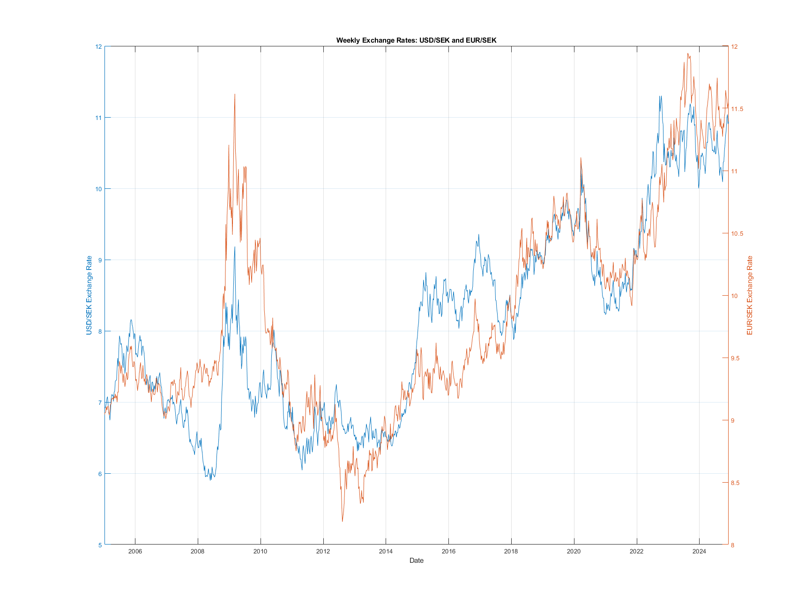
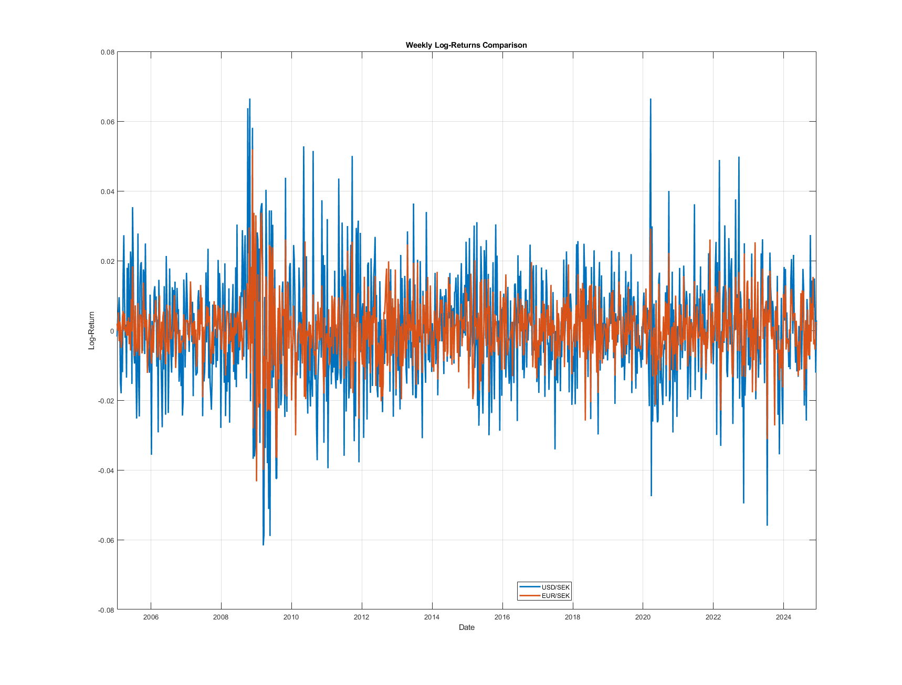
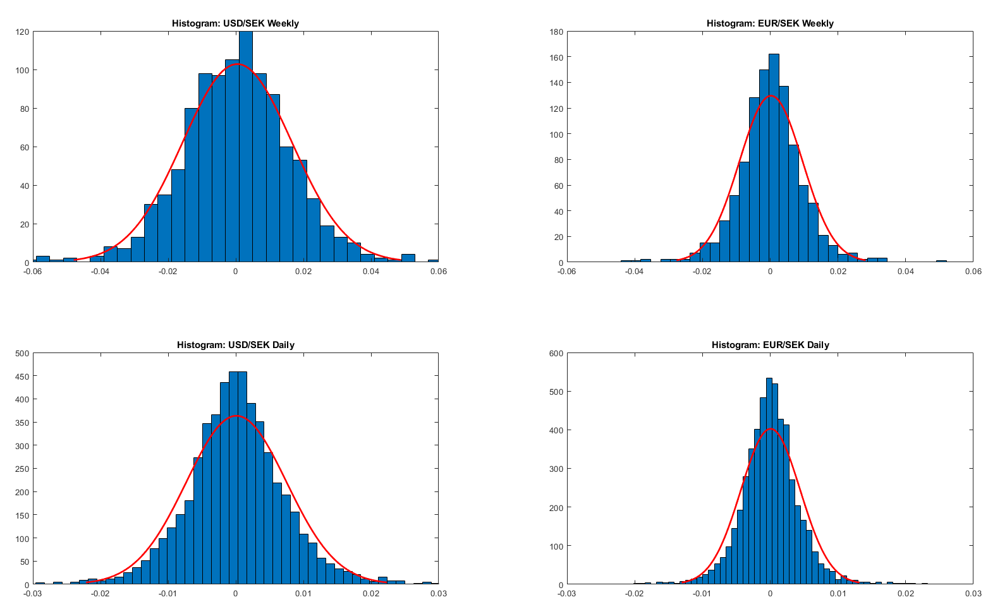
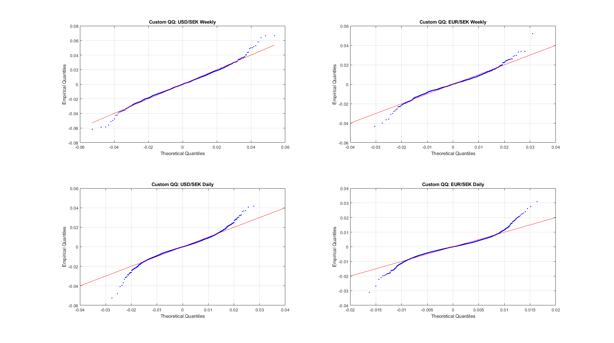
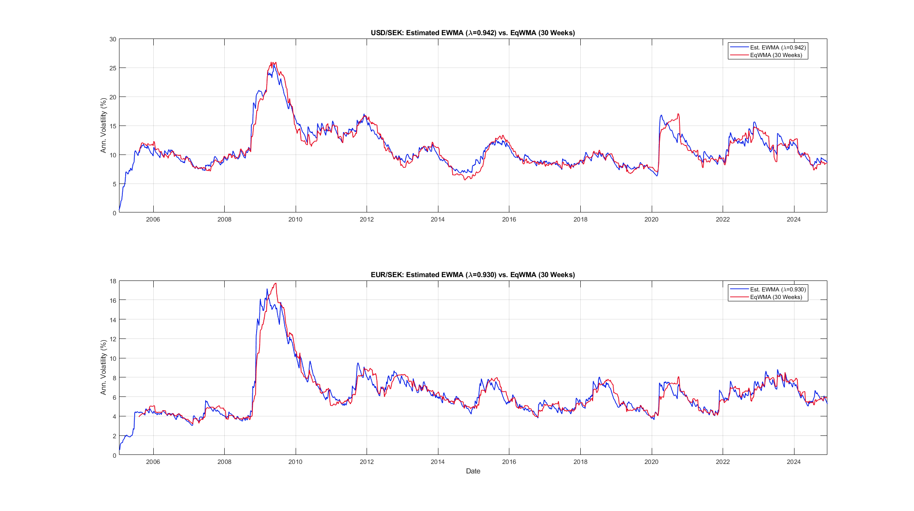
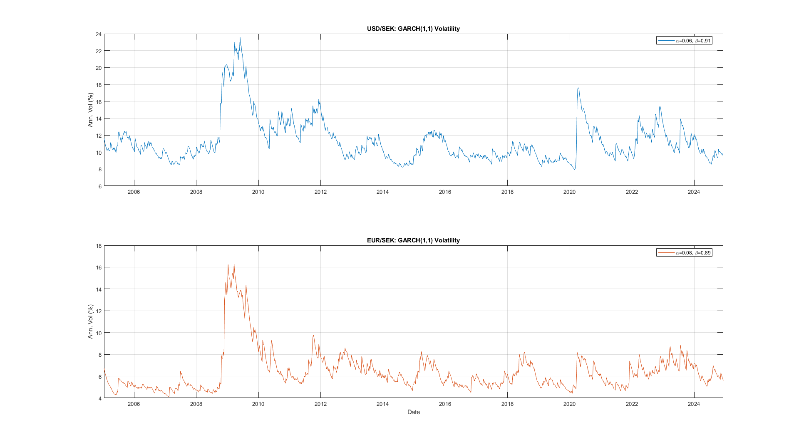
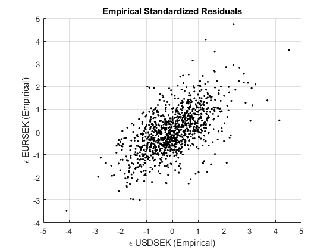
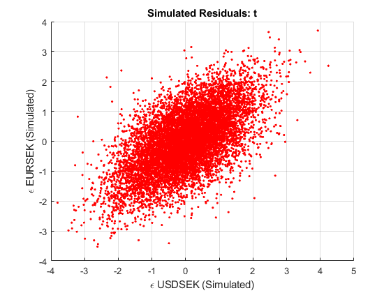
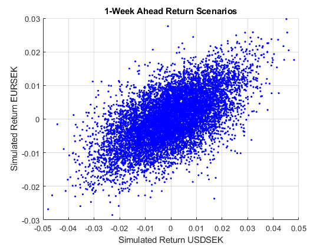
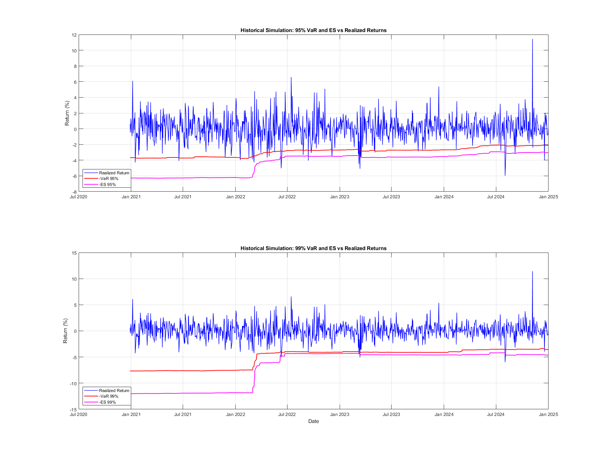

# Quantitative Financial Risk Management Modeling

A MATLAB framework for market risk estimation, non-linear volatility dynamics, copula-based dependence modeling, backtesting, and derivatives risk factor mapping.

---

## Overview

This repository provides a modeling and market risk framework across foreign exchange rates, US equities, and equity index options:

- **Module 1: Volatility Dynamics & Copula Dependence**  
  Models conditional volatility for currency pairs (USD/SEK, EUR/SEK) using Equally Weighted Moving Averages (EqWMA), Exponentially Weighted Moving Averages (EWMA / RiskMetrics), and GARCH(1,1) via Maximum Likelihood Estimation (MLE). Joint tail dependence is modeled across Archimedean and Elliptical copulas using the Inference Functions for Margins (IFM) framework.
  
- **Module 2: Market Risk, EVT, and Non-Linear Derivatives Mapping**  
  Evaluates 1-day Value at Risk (VaR) and Expected Shortfall (ES) at 95% and 99% confidence levels for an equity portfolio of major US banks (BAC, C, GS, MS, WFC). Compares parametric Variance-Covariance (VCov), Monte Carlo simulation with Student-t copula, and Extreme Value Theory (EVT) using Generalized Pareto Distribution (GPD) Peaks-Over-Threshold (POT). Backtests models using Kupiec and Christoffersen Markov tests, and maps non-linear risk factors for an S&P 500 options portfolio.

---

## Architecture & Data Flow

```
[Market Data: FX, Equities, Macro, Options]
                     │
      ┌──────────────┴──────────────┐
      ▼                             ▼
[Module 1: FX Volatility & Copulas] [Module 2: Market Risk & Derivatives]
  ├── Descriptive Statistics          ├── Parametric VCov VaR/ES
  ├── EqWMA (30w, 90w) Rolling Vol    ├── Monte Carlo (GARCH + t-Copula)
  ├── EWMA (RiskMetrics & MLE)        ├── EVT Tail Estimation (GPD / POT)
  ├── GARCH(1,1) (Unconstrained & VT) ├── Rolling Historical Simulation
  ├── Bivariate Copula Fitting (IFM)  ├── Kupiec & Christoffersen Backtesting
  └── 1-Week Ahead Return Scenarios   └── S&P 500 Options Delta-Gamma Mapping
```

---

## Module 1: Volatility Dynamics & Copula Modeling

### 1. Mathematical Formulation

#### Exponentially Weighted Moving Average (EWMA)

$$
\sigma_t^2 = (1 - \lambda) r_{t-1}^2 + \lambda \sigma_{t-1}^2
$$

Parameters estimated using Gaussian Maximum Likelihood:

$$
\ln L(\lambda) = -\frac{1}{2} \sum_{t=1}^T \left( \ln(2\pi) + \ln(\sigma_t^2) + \frac{r_t^2}{\sigma_t^2} \right)
$$

#### GARCH(1,1)

$$
\sigma_t^2 = \omega + \alpha r_{t-1}^2 + \beta \sigma_{t-1}^2, \quad \omega > 0, \; \alpha \ge 0, \; \beta \ge 0, \; \alpha + \beta < 1
$$

Under Variance Targeting (VT), the intercept $\omega$ is anchored to unconditional variance $V_L$:

$$
\omega = V_L (1 - \alpha - \beta)
$$

#### Copula Dependence (Inference Functions for Margins)
Standardized residuals $\epsilon_{i,t} = r_{i,t} / \sigma_{i,t}$ are transformed to uniform variables $U_i = F_i(\epsilon_i)$. The joint density is maximized across candidate copulas (Gaussian, Student-t, Gumbel, Clayton, Frank):

$$
\ln L_C(\theta_C) = \sum_{t=1}^T \ln c(u_{1,t}, u_{2,t}; \theta_C)
$$

---

### 2. Empirical Visualizations

#### Time Series & Distribution Properties (2x2 Grid)

| Weekly Exchange Rates | Weekly Log-Returns |
| :---: | :---: |
|  |  |
| **Return Distributions (Histograms & Normal Fit)** | **Custom Q-Q Plots (Heavy Tails)** |
|  |  |

#### Volatility Dynamics & Copula Residuals (2x2 Grid)

| EWMA vs. EqWMA (30-Week Rolling Volatility) | GARCH(1,1) Conditional Volatility |
| :---: | :---: |
|  |  |
| **Standardized Empirical Residuals** | **Simulated Residuals (Student-t Copula)** |
|  |  |

#### 1-Week Ahead Return Forecast Scenarios

<p align="center">
  
  <br/>
  <em>1-Week Ahead Joint Return Forecast Scenarios (Student-t Copula Simulation + GARCH Volatility Update)</em>
</p>

---

## Module 2: Market Risk, EVT, Backtesting & Derivatives

### 1. Mathematical Formulation

#### Parametric Variance-Covariance (VCov) VaR and ES

$$
\text{VaR}_\alpha = -\mu_p + \sigma_p \Phi^{-1}(\alpha)
$$

$$
\text{ES}_\alpha = -\mu_p + \sigma_p \frac{\phi(\Phi^{-1}(\alpha))}{1 - \alpha}
$$

#### Extreme Value Theory (EVT: Peaks-Over-Threshold)
Excesses over high threshold $u$ follow a Generalized Pareto Distribution (GPD):

$$
G_{\xi, \beta}(y) = 1 - \left( 1 + \frac{\xi y}{\beta} \right)^{-1/\xi}
$$

$$
\text{VaR}_\alpha = u + \frac{\beta}{\xi} \left( \left( \frac{T}{N_u} (1 - \alpha) \right)^{-\xi} - 1 \right)
$$

$$
\text{ES}_\alpha = \frac{\text{VaR}_\alpha}{1 - \xi} + \frac{\beta - \xi u}{1 - \xi}
$$

#### Christoffersen Conditional Coverage Test
Models first-order Markov transitions between non-violations ($I_t = 0$) and violations ($I_t = 1$):

$$
\Pi = \begin{bmatrix} 1 - \pi_{01} & \pi_{01} \\ 1 - \pi_{11} & \pi_{11} \end{bmatrix}
$$

$$
\text{LR}_{\text{ind}} = -2 \ln \left( \frac{L_0}{L_1} \right) \sim \chi^2(1)
$$

$$
\text{LR}_{\text{cc}} = \text{LR}_{\text{uc}} + \text{LR}_{\text{ind}} \sim \chi^2(2)
$$

#### Non-Linear Derivatives Risk Factor Mapping
Portfolio sensitivity gradient matrix $G$ computed from Black-Scholes-Merton (BSM) Greeks (Delta, Vega, Rho):

$$
G = \begin{bmatrix} \Delta_1 & \Delta_2 & \dots & \Delta_m \\ \mathcal{V}_1 & \mathcal{V}_2 & \dots & \mathcal{V}_m \\ \rho_1 & \rho_2 & \dots & \rho_m \end{bmatrix}
$$

Portfolio variance and marginal risk contributions (Euler capital allocation):

$$
\sigma_P^2 = (G w)' \, \Sigma_{\Delta \xi} \, (G w)
$$

$$
\text{Marginal VaR}_i = z_\alpha \frac{(\Omega w)_i}{\sqrt{w' \Omega w}}, \quad \Omega = G' \Sigma_{\Delta \xi} G
$$

---

### 2. Empirical Results

#### US Banking Portfolio Risk Comparison (BAC, C, GS, MS, WFC)

| Metric | Parametric VCov | Monte Carlo (GARCH + t-Copula) | EVT (Full Sample) | EVT (Volatile Window) |
| :--- | :--- | :--- | :--- | :--- |
| **95% 1-Day VaR** | 3.25% | 2.44% | -- | -- |
| **99% 1-Day VaR** | 4.63% | 3.51% | 5.18% | 7.36% |
| **95% 1-Day ES**  | 4.09% | 3.07% | -- | -- |
| **99% 1-Day ES**  | 5.31% | 4.11% | 8.17% | 13.33% |

*Note*: Extreme Value Theory models tail risk beyond the 95th percentile threshold ($u$). Full-sample 99% ES is 8.17% ($\xi = 0.29, \beta = 1.17\%$), expanding to 13.33% ($\xi = 0.47, \beta = 1.51\%$) during the most volatile 500-day stress window.

#### Historical Simulation Backtesting
Rolling window (500-day) historical simulation backtesting 95% and 99% VaR and ES against realized returns:

<p align="center">
  
  <br/>
  <em>Rolling 500-Day Historical Simulation: 95% and 99% VaR and ES vs. Realized Returns</em>
</p>

- **Observed Violation Rate**: 3.00% (Expected: 5.00% for 95% level)
- **Kupiec Z-Statistic**: -2.95 (Critical Value: 1.96)
- **Christoffersen Independence Test**: $\text{LR} = 3.37$ (Critical Value: 3.84, $p > 0.05$)  
  *Result*: Fail to reject independence; violations do not exhibit temporal clustering.

---

## Repository Structure

```
├── .gitignore
├── LICENSE
├── README.md
├── data/
│   ├── fx_rates.xlsx                  # USD/SEK and EUR/SEK daily & weekly series
│   └── bank_stocks_options.xlsx       # US bank stocks, S&P 500, VIX, and options book
├── src/
│   ├── 01_volatility_copulas/
│   │   ├── run_lab1.m                 # Executable MATLAB script for Module 1
│   │   ├── printResults.m             # Formatted statistical reporter
│   │   └── Lab1_interactive.mlx      # Interactive Live Script companion
│   └── 02_market_risk_derivatives/
│       ├── run_lab2.m                 # Executable MATLAB script for Module 2
│       ├── printOutput.m              # Formatted risk reporter
│       └── Lab2_interactive.mlx      # Interactive Live Script companion
└── assets/
    └── figures/                       # High-resolution empirical visualizations
         ├── fx_exchange_rates.png
         ├── fx_log_returns.png
         ├── return_distributions.png
         ├── qq_plots.png
         ├── ewma_vs_eqwma.png
         ├── garch_volatility.png
         ├── copula_empirical_residuals.png
         ├── copula_simulated_residuals.png
         ├── one_week_forecast.png
         └── historical_simulation_backtest.png
```

---

## Getting Started

### Prerequisites
- MATLAB R2020a or later.
- Required Toolboxes:
  - **Statistics and Machine Learning Toolbox** (`copulafit`, `copularnd`, `gpfit`, `histfit`, `prctile`, `norminv`)
  - **Optimization Toolbox** (`fmincon`, `optimoptions`)
  - **Financial Toolbox** (`blsdelta`, `blsvega`, `blsrho`)

### Running the Analysis
1. Clone the repository:
   ```bash
   git clone https://github.com/joehu131/quantitative-risk-management.git
   cd quantitative-risk-management
   ```
2. Run Module 1 (FX Volatility & Copulas):
   ```matlab
   cd src/01_volatility_copulas
   run_lab1
   ```
3. Run Module 2 (Market Risk & Derivatives):
   ```matlab
   cd ../02_market_risk_derivatives
   run_lab2
   ```

All data loading uses dynamic relative pathing, allowing execution from any working directory within MATLAB.

---

## License

This project is licensed under the MIT License. See the [LICENSE](LICENSE) file for details.
